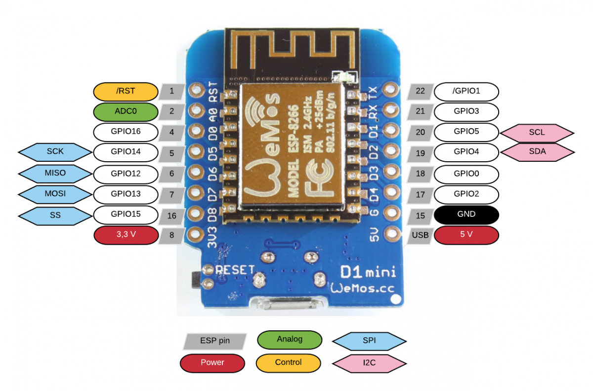

# Rozvržení
### 1. OVLÁDNOUT GITHUB  
- trochu markdownu

### 2. ÚVOD
- nastudovat zdroje
- popis co chci udělat
- volba uPython

### 3. OSNOVA
- prostředí - pyCraft - počítač
- μPython do ESP8266

### 4. OŽIVENÍ
- led blink

### 5. DRÁTOVÁNÍ

### 6. SOFTWARE & OLED
- docíit aby se na displayi objevilo "Hello word"

### 7. ZÍSKÁNÍ ČASU
- připojení ESP na internet

# Práce
Prvně jsem nainstaloval [Python](https://www.microsoft.com/cs-cz/p/python-38/9mssztt1n39l?activetab=pivot:overviewtab) do počítače.
Potom jsem nainstaloval esptool v command promtu (příkazovém řádku) / power shellu příkazem:

```pip install esptool```

Dále bylo potřeba stáhnout [micropython](http://micropython.org/download/), [frimware](http://micropython.org/download/esp8266/) a [esptool](https://github.com/espressif/esptool). Používal jsem micropython-1.12 a esp8266-20200417-v1.12-375-g28833690b.bin, nejnovější verze, firmware byl z kategorie Daily.

Teď se dostáváme do části kdy většina tutoriálů používá příkazy MacOS. Windows používá příkaz:

```python esptool.py --port <port> erase_flash```

Místo `<port>` je potřeba dosadit název portu, do kterého je ESP8266 připojeno (např. v mém případě com3). Název portu se dá zjistit v device manageru pod položkou Ports (COM & LPT).

Pro použití příkazu je potřeba přes příkaz `cd` se dostat do složky, kde máte uloženou složku s esptoolem.

Teď je potřeba dostat python do ESP8266 příkazem:

`esptool.py --port <port> --baud 460800 write_flash --flash_size=detect -fm dio 0 <název firmwaru, staženého souboru bin>`

Teď je Python úspěšně v ESP8266

Teď je na čase rozblikat built in led světlo esp8266. Na tohle je potřeba program [PuTTY](https://www.chiark.greenend.org.uk/~sgtatham/putty/latest.html). V PuTTY je potřeba se dostat do esp. Je potřeba změnit connection type na "Serial", do "Serial line" napsat port, do kterého je esp připojené. Do "Speed" napsat 115200 a pak nastává problém který jsme poměrně dlouho řešili. V levé nabídce úplně dole lze najít pod nabídkou "Connection" "Serial". Tam je potřeba změnit flow control na None. Jinak po otevření session se nedá psát.

Jakmile úspěšně otevřeme PuTTY potřebujeme importovat 2 knihovny z micropythonu. Na začátku každého kódu co se bude používat je potřeba naimportovat knihovny se kterými program bude potom pracovat. Potřeba budou knihovny time a machine. To uděláme příkazem `import <knihovna>`.

Takže by to mělo vypadat takhle:
```
>>> import time
>>> import machine
```
Teď je potřeba definovat pin:

`>>> pin = machine.Pin(2, machine.Pin.OUT)`

_pozn.: pin 2 zastává pin DH4. DH4 je pin vbudované led diody Takhle je to jen u ESP8266._



Teď to zkusíme rozsvítit a zhasnout.
```
>>> pin.on()
>>> pin.off()
```
Může to být i převráceně, takže on může diodu vypnout a naopak.

Potom můžeme definovat příkaz, kterým můžeme diodu zapnout i vypnout.
```
>>> def toggle(p):
...    p.value(not p.value())
...
...
...
>>>
```
Teď to bude fungovat jako příkaz `toggle(pin)`

A teď uděláme smyčku která bude jednodušše zapínat a vypínat diodu v určitém intervalu.
```
>>> while True:
...     toggle(pin)
...     time.sleep_ms(500)
...
...
...
>>>
```

Vbudovaná dioda by měla teď blikat.

Pro ukončení smyčky stačí restartovat esp, ale všechno se vrátí tak jak bylo, takže pak je potřeba znovu naimportovat potřebné knihovny a definovat definice.

Takže teď je načase udělat konečně ty hodiny. Na tohle jsem použil program [uPyCraft](https://randomnerdtutorials.com/uPyCraftWindows "Přímo stáhnout uPyCraft"). Prvně je potřeba uPyCraft spojit s esp, toho lze docílit cestou Tools > Serial > Pin ve kterém je esp připojené. 
V programu na hodiny bude potřeba knihovna, která není součástí micropythonu. Rozklikněte tedy položku Divice a dejte vpravo tlačítko "New" (hnedka nahoře). Do souboru vložte následující kód:
```
#MicroPython SSD1306 OLED driver, I2C and SPI interfaces created by Adafruit

import time
import framebuf

# register definitions
SET_CONTRAST        = const(0x81)
SET_ENTIRE_ON       = const(0xa4)
SET_NORM_INV        = const(0xa6)
SET_DISP            = const(0xae)
SET_MEM_ADDR        = const(0x20)
SET_COL_ADDR        = const(0x21)
SET_PAGE_ADDR       = const(0x22)
SET_DISP_START_LINE = const(0x40)
SET_SEG_REMAP       = const(0xa0)
SET_MUX_RATIO       = const(0xa8)
SET_COM_OUT_DIR     = const(0xc0)
SET_DISP_OFFSET     = const(0xd3)
SET_COM_PIN_CFG     = const(0xda)
SET_DISP_CLK_DIV    = const(0xd5)
SET_PRECHARGE       = const(0xd9)
SET_VCOM_DESEL      = const(0xdb)
SET_CHARGE_PUMP     = const(0x8d)


class SSD1306:
    def __init__(self, width, height, external_vcc):
        self.width = width
        self.height = height
        self.external_vcc = external_vcc
        self.pages = self.height // 8
        # Note the subclass must initialize self.framebuf to a framebuffer.
        # This is necessary because the underlying data buffer is different
        # between I2C and SPI implementations (I2C needs an extra byte).
        self.poweron()
        self.init_display()

    def init_display(self):
        for cmd in (
            SET_DISP | 0x00, # off
            # address setting
            SET_MEM_ADDR, 0x00, # horizontal
            # resolution and layout
            SET_DISP_START_LINE | 0x00,
            SET_SEG_REMAP | 0x01, # column addr 127 mapped to SEG0

            SET_MUX_RATIO, self.height - 1,
            SET_COM_OUT_DIR | 0x08, # scan from COM[N] to COM0
            SET_DISP_OFFSET, 0x00,
            SET_COM_PIN_CFG, 0x02 if self.height == 32 else 0x12,
            # timing and driving scheme
            SET_DISP_CLK_DIV, 0x80,
            SET_PRECHARGE, 0x22 if self.external_vcc else 0xf1,
            SET_VCOM_DESEL, 0x30, # 0.83*Vcc
            # display
            SET_CONTRAST, 0xff, # maximum
            SET_ENTIRE_ON, # output follows RAM contents
            SET_NORM_INV, # not inverted
            # charge pump
            SET_CHARGE_PUMP, 0x10 if self.external_vcc else 0x14,
            SET_DISP | 0x01): # on
            self.write_cmd(cmd)
        self.fill(0)
        self.show()

    def poweroff(self):
        self.write_cmd(SET_DISP | 0x00)

    def contrast(self, contrast):
        self.write_cmd(SET_CONTRAST)
        self.write_cmd(contrast)

    def invert(self, invert):
        self.write_cmd(SET_NORM_INV | (invert & 1))

    def show(self):
        x0 = 0
        x1 = self.width - 1
        if self.width == 64:
            # displays with width of 64 pixels are shifted by 32
            x0 += 32
            x1 += 32
        self.write_cmd(SET_COL_ADDR)
        self.write_cmd(x0)
        self.write_cmd(x1)
        self.write_cmd(SET_PAGE_ADDR)
        self.write_cmd(0)
        self.write_cmd(self.pages - 1)
        self.write_framebuf()

    def fill(self, col):
        self.framebuf.fill(col)


    def pixel(self, x, y, col):
        self.framebuf.pixel(x, y, col)

    def scroll(self, dx, dy):
        self.framebuf.scroll(dx, dy)

    def text(self, string, x, y, col=1):
        self.framebuf.text(string, x, y, col)


class SSD1306_I2C(SSD1306):
    def __init__(self, width, height, i2c, addr=0x3c, external_vcc=False):
        self.i2c = i2c
        self.addr = addr
        self.temp = bytearray(2)
        # Add an extra byte to the data buffer to hold an I2C data/command byte
        # to use hardware-compatible I2C transactions.  A memoryview of the
        # buffer is used to mask this byte from the framebuffer operations
        # (without a major memory hit as memoryview doesn't copy to a separate
        # buffer).
        self.buffer = bytearray(((height // 8) * width) + 1)
        self.buffer[0] = 0x40  # Set first byte of data buffer to Co=0, D/C=1
        self.framebuf = framebuf.FrameBuffer1(memoryview(self.buffer)[1:], width, height)
        super().__init__(width, height, external_vcc)

    def write_cmd(self, cmd):
        self.temp[0] = 0x80 # Co=1, D/C#=0
        self.temp[1] = cmd
        self.i2c.writeto(self.addr, self.temp)

    def write_framebuf(self):
        # Blast out the frame buffer using a single I2C transaction to support
        # hardware I2C interfaces.
        self.i2c.writeto(self.addr, self.buffer)

    def poweron(self):
        pass


class SSD1306_SPI(SSD1306):
    def __init__(self, width, height, spi, dc, res, cs, external_vcc=False):
        self.rate = 10 * 1024 * 1024
        dc.init(dc.OUT, value=0)
        res.init(res.OUT, value=0)
        cs.init(cs.OUT, value=1)
        self.spi = spi
        self.dc = dc
        self.res = res
        self.cs = cs
        self.buffer = bytearray((height // 8) * width)
        self.framebuf = framebuf.FrameBuffer1(self.buffer, width, height)
        super().__init__(width, height, external_vcc)

    def write_cmd(self, cmd):
        self.spi.init(baudrate=self.rate, polarity=0, phase=0)
        self.cs.high()
        self.dc.low()
        self.cs.low()
        self.spi.write(bytearray([cmd]))
        self.cs.high()

    def write_framebuf(self):
        self.spi.init(baudrate=self.rate, polarity=0, phase=0)

        self.cs.high()
        self.dc.high()
        self.cs.low()
        self.spi.write(self.buffer)
        self.cs.high()

    def poweron(self):
        self.res.high()
        time.sleep_ms(1)
        self.res.low()
        time.sleep_ms(10)
        self.res.high()

>>> state: 5 -> 2 (2c0)

rm 0
```
Pak klikněte na tlačítko uložit (3.) a soubor pojmenujte "sdd1306.py". Vlevo nahoře by měl být pod položkou "divice" teď soubor sdd1306.py. 

Teď se přesuneme do souboru boot.py který je taky pod položkou device. Tam vložíme tenhle kód:
```
# ESP8266 MicroPython Clock
# from https://github.com/ecaha/jiri

import ssd1306
import utime
from machine import RTC, I2C, Pin
from ssd1306 import SSD1306_I2C


# SSD1306 OLED display
oled = SSD1306_I2C(128, 64, I2C(scl=Pin(5), sda=Pin(4)))
oled.fill(0)

# set this to your time when you are starting this program
# year, month, day, 1, hour, minute, second, subsecond
rtc = RTC()
rtc.datetime((2020, 4, 20, 1, 19, 51, 0, 0))

# set timer
update_time = utime.ticks_ms()

# main loop
while True:
  update_time = utime.ticks_ms()
        
  # generate formated date/time strings
  date_str = "Datum:{1:02d}/{2:02d}/{0:4d}".format(*rtc.datetime())
  time_str = "Cas: {4:02d}:{5:02d}:{6:02d}".format(*rtc.datetime())

  # update SSD1306 OLED display
  oled.fill(0)
  oled.text("ESP8266 hodiny", 0, 5)
  oled.text(date_str, 0, 25)
  oled.text(time_str, 0, 45)
  oled.show()
    
  utime.sleep(0.5)
```
V rtc.datetime je potřeba upravit před spuštěním datum na konkrétní čas.

Formát je: `rtc.datetime((rok, měsíc, den, 1, hodina, minuta, sekunda, milisekunda))`

__A hodiny jsou hotové!__


 
<video src="https://github.com/ecaha/jiri/blob/master/VID_29470509_093311_875.mp4" width="1280" height="720" controls preload type="video/mp4"></video>


# Zdroje

[ESP8266 Part #3 – SSD1306 OLED Displays with MicroPython](https://www.youtube.com/watch?v=Fl61uiyRQdM "Zobrazit na YouTube")

[ESP8266 NodeMCU OLED Display Clock Iot Tutorial](https://www.youtube.com/watch?v=gC8btktOYOg "Zobrazit na YouTube")

[MicroPython: OLED Display with ESP32 and ESP8266](https://randomnerdtutorials.com/micropython-oled-display-esp32-esp8266/ "Zobrazit na randomnerdtutorials.com")

[1. Getting started with MicroPython on the ESP8266](http://docs.micropython.org/en/latest/esp8266/quickref.html "Zobrazit na docs.micropython.org")

[2. Getting a MicroPython REPL prompt](http://docs.micropython.org/en/latest/esp8266/tutorial/repl.html "Zobrazit na docs.micropychon.org")

[Very Simple MicroPython ESP8266/ESP-12 Web Clock](https://www.hackster.io/alankrantas/very-simple-micropython-esp8266-esp-12-web-clock-3c5c6f "Zobrazit na hackster.io")
